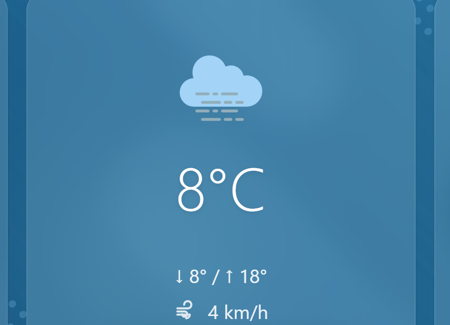

# 📦 Guide de Build - SEE Display

> **Dernière mise à jour :** 7 Mars 2026 — v2.0.0  
> **Plateforme cible unique :** Linux x86_64 (AppImage)

---

## 🤖 Commande Copilot rapide

Quand l'utilisateur dit **"build appimage"**, l'agent doit :

1. **Demander la version** souhaitée (ex: `1.12.7`)
2. **Mettre à jour** `"version"` dans `package.json`
3. **Lancer le build** via WSL :
   ```powershell
   wsl -d Ubuntu -- bash -c "cd /mnt/c/Programation/seedisplay && npx electron-builder --linux AppImage --x64"
   ```
4. **Vérifier** le fichier généré dans `dist/v<version>/`
5. **Afficher** le résultat (nom + taille)

> Ne PAS lancer `npm run build:linux` sur Windows natif (échoue sans `mksquashfs`).  
> Toujours passer par **WSL Ubuntu**.

---

## ⚠️ Build actuel

Depuis la v2.0.0, **seul le format AppImage Linux x64 est buildé**.

| Format | Arch | Statut |
|--------|------|--------|
| **AppImage** | **x64** | ✅ **Seul build actif** |

---

## 🚀 Comment builder

### Prérequis

- **Node.js** et **npm** installés
- **WSL Ubuntu** si on build depuis Windows (mksquashfs nécessaire)
- Dépendances installées : `npm install`

### Commande de build

**Depuis Linux ou WSL :**
```bash
cd /chemin/vers/seedisplay
npx electron-builder --linux AppImage --x64
```

**Depuis Windows via WSL :**
```powershell
wsl -d Ubuntu -- bash -c "cd /mnt/c/Programation/seedisplay && npx electron-builder --linux AppImage --x64"
```

> ⚠️ `npm run build:linux` fonctionne aussi mais **doit être exécuté dans un environnement Linux** (WSL ou natif). Le build AppImage échoue sur Windows natif car `mksquashfs` n'est pas disponible.

### Résultat attendu

```
dist/v1.12.x/
├── SEE-Display-x86_64.AppImage      (~128 Mo)
├── latest-linux.yml                  (Manifest auto-update)
├── builder-effective-config.yaml
├── builder-debug.yml
└── linux-unpacked/                   (Version non packagée)
```

---

## 📋 Checklist de Release

1. [ ] Bumper la version dans `package.json`
2. [ ] `npm test` — tous les tests passent
3. [ ] Builder via WSL : `npx electron-builder --linux AppImage --x64`
4. [ ] Vérifier `dist/v<version>/SEE-Display-x86_64.AppImage` (~128 Mo)
5. [ ] Vérifier `dist/v<version>/latest-linux.yml` (version + sha512 corrects)
6. [ ] Publier sur GitHub Releases avec l'AppImage + `latest-linux.yml`

---

## 🔧 Configuration package.json (section build > linux)

```json
{
  "linux": {
    "icon": "build/icon.png",
    "target": [
      {
        "target": "AppImage",
        "arch": ["x64"]
      }
    ],
    "category": "Utility"
  },
  "appImage": {
    "artifactName": "SEE-Display-${arch}.AppImage"
  }
}
```

---

## 🔍 Dépannage

### `mksquashfs: file does not exist`
**Cause :** Build lancé sur Windows natif.  
**Solution :** Builder via WSL (`wsl -d Ubuntu -- bash -c "..."`) ou depuis une machine Linux.

### L'AppImage ne se lance pas
**Cause :** Pas les permissions d'exécution.  
**Solution :** `chmod +x SEE-Display-x86_64.AppImage`

### Build trop lente
**Cause :** Rebuild des dépendances natives.  
**Solution :** Les builds suivantes sont plus rapides grâce au cache electron-builder.
